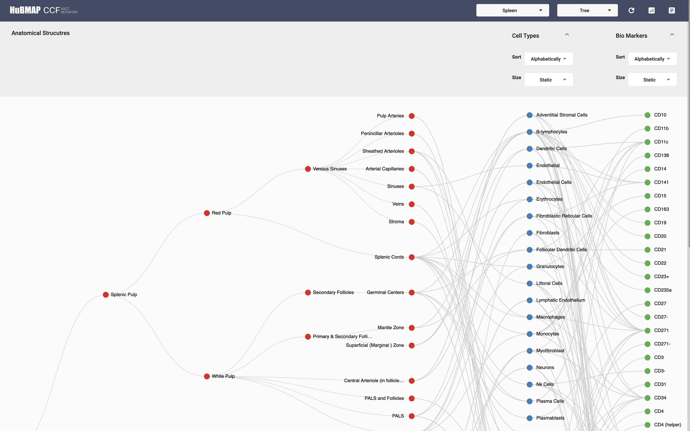

# HuBMAP CCF ASCT+B Reporter

The [CCF ASCT Reporter](https://hubmapconsortium.github.io/ccf-asct-reporter/) is a basic visualization tool for displaying the [flattened ASCT tables](https://docs.google.com/spreadsheets/d/1j_SLhFipRWUcRZrCDfNH15OWoiLf7cJks7NVppe3htI/edit#gid=1218756021) built using Angular 9.

[](https://github.com/hubmapconsortium/ccf-asct-reporter)
[](https://github.com/hubmapconsortium/ccf-asct-reporter/blob/master/LICENSE) 
[](https://github.com/hubmapconsortium/ccf-asct-reporter/blob/master/LICENSE) 
[](https://github.com/npm/cli)


## Overview
The [CCF ASCT+B Reporter](https://hubmapconsortium.github.io/ccf-asct-reporter/) iincludes a partonomy tree that presents relationships between various anatomical structures and substructures, that is combined with their respective cell types and biomarkers via a bimodal network. The reporter also presents an indented list tree for a more traditional look. Along with visualizing, the reporter has a report generator that enlists various meta data for the visualized ASCT table, which is downloadable. There is also an in-house debug logger that lists any issues related to the data provided in the table.

## Installation
For development,
```shell
$ git clone https://github.com/hubmapconsortium/ccf-asct-reporter
$ cd ccf-asct-reporter
$ npm install
$ ng serve
```

For deployment,
```shell
$ git clone https://github.com/hubmapconsortium/ccf-asct-reporter
$ cd ccf-asct-reporter
$ npm run build -- --base-href=/ccf-asct-reporter/ --configuration=production
$ npm run deploy
```

For updating table data,
```shell
$ npm run data # for updating all sheets
$ npm run data <sheet> # for updating a specific sheet
```

## Details

### Currently supported ASCT Tables
1. [Spleen](https://docs.google.com/spreadsheets/d/1j_SLhFipRWUcRZrCDfNH15OWoiLf7cJks7NVppe3htI/edit#gid=1283919854)
2. [Liver](https://docs.google.com/spreadsheets/d/1j_SLhFipRWUcRZrCDfNH15OWoiLf7cJks7NVppe3htI/edit#gid=1218756021)
3. [Kidney](https://docs.google.com/spreadsheets/d/1j_SLhFipRWUcRZrCDfNH15OWoiLf7cJks7NVppe3htI/edit#gid=1074409228)
4. [Small Intestile](https://docs.google.com/spreadsheets/d/1j_SLhFipRWUcRZrCDfNH15OWoiLf7cJks7NVppe3htI/edit#gid=766906089)
5. [Large Intestine](https://docs.google.com/spreadsheets/d/1j_SLhFipRWUcRZrCDfNH15OWoiLf7cJks7NVppe3htI/edit#gid=82644608)
6. [Lymph Nodes](https://docs.google.com/spreadsheets/d/1j_SLhFipRWUcRZrCDfNH15OWoiLf7cJks7NVppe3htI/edit#gid=272157091)
7. [Heart](https://docs.google.com/spreadsheets/d/1j_SLhFipRWUcRZrCDfNH15OWoiLf7cJks7NVppe3htI/edit#gid=1799670106)
8. [Skin](https://docs.google.com/spreadsheets/d/1j_SLhFipRWUcRZrCDfNH15OWoiLf7cJks7NVppe3htI/edit#gid=1268820100)

### How it works
This section describes the constuctution of the various visualizations that the reporter displays. 

#### Partonomy Tree
The partonomy tree visualizes anatomical structures and substructures. They are color coded in red. It makes use of [Vega's Tree Layout](https://vega.github.io/vega/examples/tree-layout/) to visualize relationships between anatomical structures and substructures. This is housed in the [Tree Component](https://github.com/hubmapconsortium/ccf-asct-reporter/blob/master/src/app/tree/tree.component.ts). 

The data is fetched through the [`getSheetData()`](https://github.com/hubmapconsortium/ccf-asct-reporter/blob/d6b98bff6fc8d88c14ee8c38809a063db39d31bc/src/app/services/sheet.service.ts#L80) function that returns a JSON of the ASCT+B table data parsed by [PapaParse](https://www.papaparse.com/). The function [`makeTreeData()`](https://github.com/hubmapconsortium/ccf-asct-reporter/blob/d6b98bff6fc8d88c14ee8c38809a063db39d31bc/src/app/tree/tree.service.ts#L66) builds the tree shown in the partonomy. Using the classes [`TNode`](https://github.com/hubmapconsortium/ccf-asct-reporter/blob/3e7837c5af98945c61b9de6b7edb7e408ed77297/src/app/sheet.service.ts#L13) and [`Tree`](https://github.com/hubmapconsortium/ccf-asct-reporter/blob/3e7837c5af98945c61b9de6b7edb7e408ed77297/src/app/sheet.service.ts#L32), systematically builds a tree where each node has a parent, id and name. Multiple occurances of nodes in the ASCT+B tables are automatically skipped by the function. The width of the tree is set to a precomputed value present in the [config service](https://github.com/hubmapconsortium/ccf-asct-reporter/blob/master/src/app/services/sconfig.service.ts). On having the constructed data, the [tree spec](https://github.com/hubmapconsortium/ccf-asct-reporter/blob/d6b98bff6fc8d88c14ee8c38809a063db39d31bc/src/app/tree/tree.component.ts#L106) is formed that builds the tree using `embed()`.

#### Bimodal Network
The bimodal network links the anatomical structures to the cell types, and then the cell types to the biomarkers. The cell types are color coded in blue and the biomarkers in green. This is housed in the [bimodal component](https://github.com/hubmapconsortium/ccf-asct-reporter/blob/master/src/app/bimodal/bimodal.component.ts).

After the partonomy tree is rendered onto the DOM, the function [`makeASCTData()`](https://github.com/hubmapconsortium/ccf-asct-reporter/blob/d6b98bff6fc8d88c14ee8c38809a063db39d31bc/src/app/bimodal/bimodal.service.ts#L44) is called that accepts the ASCT+B table data and the partonomy tree data. The `treeData` is an array of objects that contains information of the all the nodes in the tree (positions, names, colors, etc). Using this data, paths between the anatomical structures and cell types a formed. The `x` and `y` coordinates of the leaf nodes of the tree is used to start the paths. Each of the structures are divided into multiple groups,
- Group 1: Anatomical Structures
- Group 2: Cell Types
- Group 3: Biomarkers

After all the nodes have been pushed using the [`BMNode`](https://github.com/hubmapconsortium/ccf-asct-reporter/blob/d6b98bff6fc8d88c14ee8c38809a063db39d31bc/src/app/bimodal/bimodal.service.ts#L9) class, the links are constucted. This is done by using the position of the nodes in the `nodes` array, specifying the source (`s`) and the target(`t`). A sample of how the `ASCTGraphData` looks like is shown below,
```js
nodes:[
    ...,
    {
        color: "#808080",
        first: "Penincillar Arterioles",
        fontSize: 14,
        group: 1,
        id: 1,
        name: "Penincillar Arterioles",
        nodeSize: 300,
        x: 0,
        y: 104.875,
    },
    ...
],
links: [
    ...,
    {
        path: "M0,52.4375L350,50"
        s: 0 // source node
        t: 24 // target node
    }
]
```

The bimodal network contans a few functions that is used to sort the nodes,
1. Sort Alphabetically: Alphabetically sorts the nodes.
2. Sort by degree: Sorts the nodes based on the number of connections to a particular node. Makes use of the [`makeMarkerDegree()`](https://github.com/hubmapconsortium/ccf-asct-reporter/blob/master/src/app/services/sheet.service.ts#L94) and [`makeCellDegree()`](https://github.com/hubmapconsortium/ccf-asct-reporter/blob/master/src/app/services/sheet.service.ts#L127) functions for calculating the degree of markers and cells respectively.
3. Sort by size: Nodes can be sorted by their relative sizes that depends on their degree. 

Each node in the network can be hovered over to highlight its path links. Additionally, for better visual purposes, a node can be clicked to persist the highlight of the links.

#### Indent List
This visualization is a traditional, hierarchical structure. This displays anatomical structures, sub-structures and cell types. This is housed in the [Indent component](https://github.com/hubmapconsortium/ccf-asct-reporter/blob/master/src/app/indent/indent.component.ts). This makes use the of [Angular Material Tree](https://material.angular.io/components/tree/overview).

The function [`makeIndentData()`](https://github.com/hubmapconsortium/ccf-asct-reporter/blob/3e7837c5af98945c61b9de6b7edb7e408ed77297/src/app/sheet.service.ts#L503) builds the data for the indented list. 

#### Report Generator
The report generator lists different meda data of the data which are downloadable. This can be accessed by clicking on the report icon in the navbar, which opens a navigation drawer. There are 2 main sections,
1. **Overview**: This section contains the following statistics,
   - Unique anatomical structures
   - Unique cell types
   - Unique bio markers
   - Anatomical Structures with no uberon links
   - Cell types with no CL links
   - Biomarkers with no Go/UniPot link (as the moment none of the markers have this link)
2. **Details**: This section has expandable panels that list the above mentioned node names in alphabetical order.

#### Debug Logs
The debug logger is a tool that lists various problems (if at all) with the data that is to be visualized. These include nodes that have multiple parents, data not being fetched properly, changing of sheets etc. These logs are session specific.

### Scripts

#### `getData.sh`
This shell script is used to fetch data from the flattened tables. The sheetId and GID for the sheets are stored in `scriptdata.csv`. 

The script encorporates 2 options,
1. No parameters: Updates the data of all the sheets from google sheets.
   ```shell
   $ npm run data
   ```
2. <sheet_name> parameter: Updates the data of a specific sheet.
   ```shell
   $ npm run data <sheet_name>
   ```

For additional help,
```shell
$ npm run data help
```


## Snippets





## License
[MIT](https://choosealicense.com/licenses/mit/)